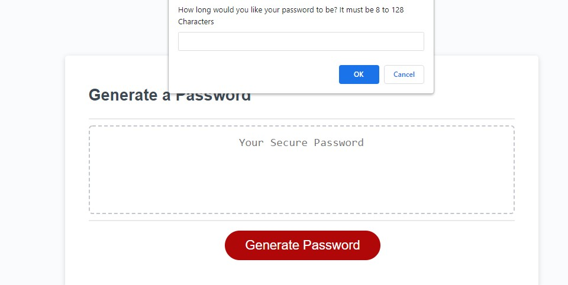

# Random Password Generator
## Description

- Here is a Random Password Generator, written in javascript, this was created so people who use it can randomly create a password for protecting sensitive information. This was created as part of my study of javascript at Monash University Bootcamp for programming

- The problem it solves is that if you want a random password it will create it for you but not store it anywhere. 

- I got a better understanding of Javascript while working on this project.

## Table of Contents (Optional)

If your README is long, add a table of contents to make it easy for users to find what they need.

- [Installation](#installation)
- [Usage](#usage)
- [Credits](#credits)
- [License](#license)

## Installation

To access and use this project you may click on this link to access it

- https://breakfireaus.github.io/random-password-generator/

## Usage

- Screenshots below

- To use the program you need to click on the generate password button which is Red. Then follow the prompts and confirmation prompts so the program can  and it will automatically generate a password

- Prompt for how many characters.

- Confirmation prompt for type of characters.

- 2 types of error messages if not the right integer number and no characters selected.

- Successfully run program.

## Credits

- Askbcs team at the bootcamp
- My Instructor Chee
- Prince
- https://developer.mozilla.org/en-US/docs/Web/API/Window/alert
- https://developer.mozilla.org/en-US/docs/Web/API/Window/confirm
- https://developer.mozilla.org/en-US/docs/Web/API/Window/prompt
- https://developer.mozilla.org/en-US/docs/Web/JavaScript/Reference/Statements/let
- https://developer.mozilla.org/en-US/docs/Web/JavaScript/Reference/Global_Objects/isNaN
- https://developer.mozilla.org/en-US/docs/Web/JavaScript/Reference/Statements/if...else
- https://developer.mozilla.org/en-US/docs/Glossary/Primitive
- https://developer.mozilla.org/en-US/docs/Web/JavaScript/Reference/Global_Objects/Array
- https://developer.mozilla.org/en-US/docs/Web/JavaScript/Reference/Statements/var
- https://developer.mozilla.org/en-US/docs/Web/API/EventTarget/addEventListener
- https://developer.mozilla.org/en-US/docs/Web/JavaScript/Reference/Global_Objects/String/charAt
- https://developer.mozilla.org/en-US/docs/Web/API/Document/querySelector
- https://developer.mozilla.org/en-US/docs/Web/JavaScript/Reference/Global_Objects/String/includes

## License

MIT License

Copyright (c) 2022 breakfireaus

Permission is hereby granted, free of charge, to any person obtaining a copy
of this software and associated documentation files (the "Software"), to deal
in the Software without restriction, including without limitation the rights
to use, copy, modify, merge, publish, distribute, sublicense, and/or sell
copies of the Software, and to permit persons to whom the Software is
furnished to do so, subject to the following conditions:

The above copyright notice and this permission notice shall be included in all
copies or substantial portions of the Software.

THE SOFTWARE IS PROVIDED "AS IS", WITHOUT WARRANTY OF ANY KIND, EXPRESS OR
IMPLIED, INCLUDING BUT NOT LIMITED TO THE WARRANTIES OF MERCHANTABILITY,
FITNESS FOR A PARTICULAR PURPOSE AND NONINFRINGEMENT. IN NO EVENT SHALL THE
AUTHORS OR COPYRIGHT HOLDERS BE LIABLE FOR ANY CLAIM, DAMAGES OR OTHER
LIABILITY, WHETHER IN AN ACTION OF CONTRACT, TORT OR OTHERWISE, ARISING FROM,
OUT OF OR IN CONNECTION WITH THE SOFTWARE OR THE USE OR OTHER DEALINGS IN THE
SOFTWARE.

